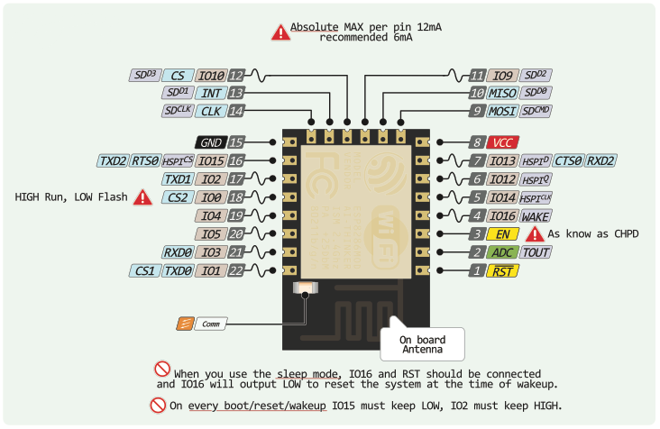

| GPIO  |            |           |         |                                           |            | Arduino |                  |
| ----- | ---------- | --------- | ------- | ----------------------------------------- | ---------- | ------- | ---------------- |
| 0     |            | SPI_CS2   |         | HIGH: normal, LOW: programming            | LOW / HIGH | D3      | button LOW / BLK |
| 1     |            | SPI_CS1   | U0_TXD  |                                           | TX         | D10     | TX               |
| 2     |            |           | U1_TXD  | on boot HIGH for programming              | HIGH       | D4      | One WIRE (HIGH)  |
| 3     |            |           | U0_RXD  |                                           | RX         | D9      | RX               |
| 4     |            |           |         |                                           | I2C        | D2/SDA  | SDA              |
| 5     |            |           |         |                                           | I2C        | D1/SCL  | SCL              |
| 6     | SDIO_CLK   | SPI_CLK   |         | used to connect flash 4MB                 | reserved   |
| 7     | SDIO_DATA0 | SPI_MISO  |         | used to connect flash 4MB                 | reserved   |
| 8     | SDIO_DATA1 | SPI_MOSI  | U1_RXD  | used to connect flash 4MB                 | reserved   |
| 9     | SDIO_DATA2 | SPI_HD    | HSPI_HD | used to connect flash 4MB                 | reserved   |
| 10    | SDIO_DATA3 | SPI_WP    | HSPI_WP | used to connect flash 4MB                 | reserved   |
| 11    | SDIO_CMD   | SPI_CS0   |         | used to connect flash 4MB                 | reserved   |
| 12    | MTDI       | HSPI_MISO |         |                                           | MISO       | D6      | PWM R            |
| 13    | MTCK       | HSPI_MOSI | U0_CTS  |                                           | MOSI       | D7      | PWM G            |
| 14    | MTMS       | HSPI_CLK  |         |                                           | CLK        | D5      | PWM B            |
| 15    | MTDO       | HSPI_CS   | U0_RTS  | on boot LOW for programming               | LOW / CS   | D8      | PWM W (LOW)      |
| 16    | XPD_DCDC   |           |         | sleep mode to EXT_RSTB (allow deep sleep) | RESET      | D0      | RST              |
| 17    | ADC        |           |         | voltage 0—1.0V                            | Battery    | A0      |
| RESET |            |           |         |                                           |            |         | Pull UP          |

15: WS2812, adressable led

Read information on: https://www.kloppenborg.net/images/blog/esp8266/esp8266-esp12e-specs.pdf

Available pins: http://www.rabbithacks.com/esp8266/esp12-e-directly-usable-gpio-pins/

PWM on all the pins !
HSPI (screen or other): 12 13 14 15
PWM: R12 G15 B13
ADC: TOUT
I2C: SCL14 SDA2

## Flashing board ?

You need to maintain `SW2` while pressing `SW1` (reset) in order to set the ESP-12E in programing mode.

- https://hackaday.com/2015/03/18/how-to-directly-program-an-inexpensive-esp8266-wifi-module/
- https://easyeda.com/olegos76/ESP8266_arduino_IDE-d4457f9439fd4de7a8970ff36a4957d6
- https://www.instructables.com/id/3-Simple-Ways-of-Programming-an-ESP8266-12X-Module/
- https://www.codeproject.com/Articles/1152777/Programming-a-standalone-ESP-using-Arduino-IDE-and

## Programming from the arduino a nodeMcu

- https://www.instructables.com/id/Quick-Start-to-Nodemcu-ESP8266-on-Arduino-IDE/
- https://www.instructables.com/id/ESP8266-controlling-Neopixel-LEDs-using-Arduino-ID/

## FreeRTOS

It seems impossible to program the ESP-12E with RTOS from the Arduino IDE.

The SDK is maintained by Expressif and it svailable on:

https://github.com/espressif/ESP8266_RTOS_SDK

You will also find on this page the instructions to install the SDK

## Functions

- RGBW
- PCA9685 + 4 x BSP75
- WS2812 : addressable led
- Luminosity: TCS3400 or VEML6040 or VEML7700
- Pressure: MS5637
- Humidity / Temperature: ChipCAP2 or Si7021
- Power monitoring
