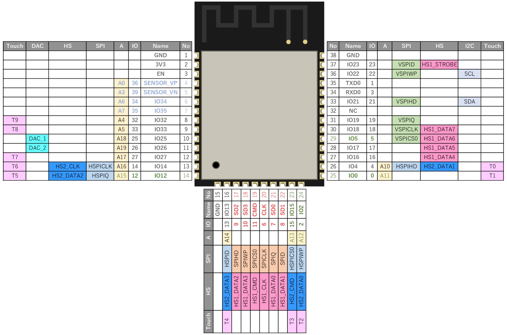

| #  | Name           | A     | SPI     | HS         | I2C | Touch | Used        | RTC        |
|----|----------------|-------|---------|------------|-----|-------|-------------|------------|
| 1  | GND            |       |         |            |     |       |             |            |
| 2  | 3V3            |       |         |            |     |       |             |            |
| 3  | EN             |       |         |            |     |       |             |            |
| 4  | SENSOR_VP/IO36 | A0    |         |            |     |       | Charging    | RTC_GPIO0  |
| 5  | SENSOR_VN/IO39 | A3    |         |            |     |       |             | RTC_GPIO3  |
| 6  | IO34           | A6    |         |            |     |       | OneWire1    | RTC_GPIO4  |
| 7  | IO35           | A7    |         |            |     |       | OneWire2    | RTC_GPIO5  |
| 8  | IO32           | A4    |         |            |     | T9    | Ext3        | RTC_GPIO9  |
| 9  | IO33           | A5    |         |            |     | T8    | Ext4        | RTC_GPIO8  |
| 10 | IO25           | A18 * |         |            |     |       | Ext1        | RTC_GPIO6  |
| 11 | IO26           | A19 * |         |            |     |       | Ext2        | RTC_GPIO7  |
| 12 | IO27           | A17 * |         |            |     | T7    | ADC battery | RTC_GPIO17 |
| 13 | IO14           | A16 * | HSPICLK | HS2_CLK    |     | T6    | Blue        | RTC_GPIO16 |
| 14 | IO12           | A15 * | HSPIQ   | HS2_DATA2  |     | T5    | Red         | RTC_GPIO15 |
| 15 | GND            |       |         |            |     |       |             |            |
| 16 | IO13           | A14 * | HSPID   | HS2_DATA3  |     | T4    | Green       | RTC_GPIO14 |
| 17 | SHD/SD2        |       | SPIHD   | HS1        |     |       |             |            |
| 18 | SWP/SD3        |       | SPIWP   |            |     |       |             |            |
| 19 | SCS/CMD        |       | SPICS0  |            |     |       |             |            |
| 20 | SCK/CLK        |       | SPICLK  |            |     |       |             |            |
| 21 | SDO/SD0        |       | SPIQ    |            |     |       |             |            |
| 22 | SDI/SD1        |       | SPID    |            |     |       |             |            |
| 23 | IO15           | A13 * | HSPICS0 |            |     | T3    | White       | RTC_GPIO13 |
| 24 | IO2            | A12 * | HSPIWP  |            |     | T2    | RESERVED    | RTC_GPIO12 |
| 25 | IO0            | A11 * |         |            |     | T1    | Prog        | RTC_GPIO11 |
| 26 | IO4            | A10 * | HSPIHD  | HS2_DATA1  |     | T0    | OneWire1    | RTC_GPIO10 |
| 27 | IO16           |       |         | HS1_DATA4  |     |       |             |            |
| 28 | IO17           |       |         | HS1_DATA5  |     |       |             |            |
| 29 | IO5            |       | VSPICS0 | HS1_DATA6  |     |       |             |            |
| 30 | IO18           |       | VSPICLK | HS1_DATA7  |     |       | Blink LED   |            |
| 31 | IO19           |       | VSPIQ   |            |     |       |             |            |
| 32 | NC             |       |         |            |     |       |             |            |
| 33 | IO21           |       | VSPIHD  |            | SDA |       | SDA         |            |
| 34 | RXD0           |       |         |            |     |       | RX          |            |
| 35 | TXD0           |       |         |            |     |       | TX          |            |
| 36 | IO22           |       | VSPIWP  |            | SCL |       | SCL         |            |
| 37 | IO23           |       | VSPID   | HS1_STROBE |     |       |             |            |
| 38 | GND            |       |         |            |     |       |             |            |

*: not usable with WIFI

## ESP32-Wroom32 datasheet

https://www.espressif.com/sites/default/files/documentation/esp32-wroom-32_datasheet_en.pdf

## Official Espressif hardware design guidelines

https://www.espressif.com/sites/default/files/documentation/esp32_hardware_design_guidelines_en.pdf

## Really DIY ESP32 board

https://www.instructables.com/id/DIY-ESP32-Development-Board-ESPer/

## Programming an ESP32 from Arduino IDE

Start by installing the ESP32 board in Arduino IDE
https://randomnerdtutorials.com/installing-the-esp32-board-in-arduino-ide-mac-and-linux-instructions/ (Mac/Linux)
https://randomnerdtutorials.com/installing-the-esp32-board-in-arduino-ide-windows-instructions/ (Windows)

Getting started with ESP32 (including blink example)
https://randomnerdtutorials.com/getting-started-with-esp32/

Some debug information
https://github.com/espressif/esptool/wiki/ESP32-Boot-Mode-Selection

## Flashing board

In Arduino IDE, select "ESP32 Wrover module" (>tools>boards), connect the UART programmer to the board (make sure it is in the right orientation), select the corresponding port (>tools>port). Write a simple sketch (for example blink using pin18 for the red light), and upload it to the board, after seeing the "Connecting..." message in the lower windows of Arduino IDE, press both buttons (PROG and RESET), release the "RESET" button first and then release the "BOOT" button, the upload should start. After this, press reset so that the latest code runs on the board (you should see the red light blinking).

To avoid worrying about pressing the button, connect 10 uF electrolytic capacitor between the EN pin and GND (may work or not depending on boards...)
(https://randomnerdtutorials.com/solved-failed-to-connect-to-esp32-timed-out-waiting-for-packet-header/)

## Resources

Many ESP32 tutorials/projects are available at Random Nerd Tutorials (web-based, sensor-based, data logging, deep sleep...):
https://randomnerdtutorials.com/projects-esp32/

Schema for a dev kit: https://dl.espressif.com/dl/schematics/esp32_devkitc_v4-sch.pdf
Ultra low power tips for ESP32: http://iot-bits.com/ultra-low-power-design-esp32-10-tips/

## FreeRTOS

## Functions

- RGBW
- PCA9685 + 4 x BSP75
- WS2812 : addressable led
- Luminosity: TCS3400 or VEML6040 or VEML7700
- Pressure: MS5637
- Humidity / Temperature: ChipCAP2 or Si7021
- Power monitoring
